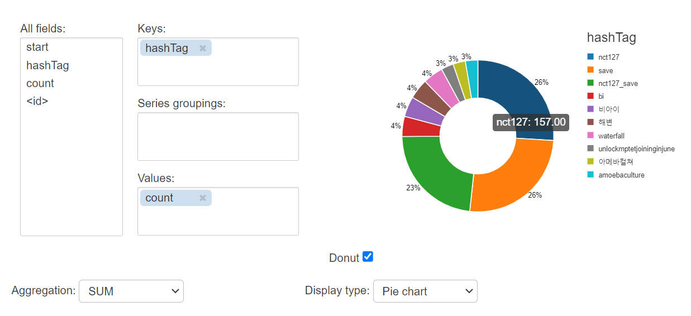
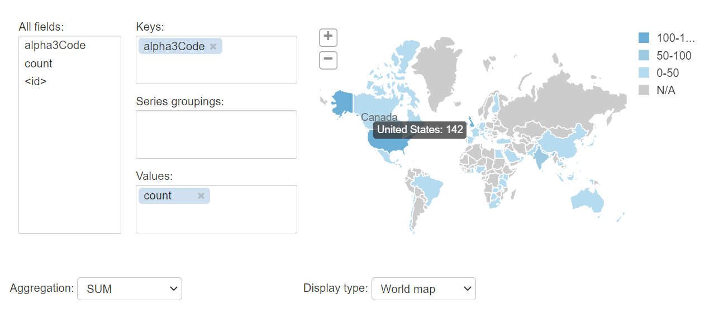

# Spark Structured Streaming
## 1. Practice Lab
### 1.1. Streaming Concepts Lab
- Stream data from a file and write it out to a distributed file system
- List and Stop active streams
- Source: [Streaming Concept Lab](https://databricks-prod-cloudfront.cloud.databricks.com/public/4027ec902e239c93eaaa8714f173bcfc/632996160314877/288086402606599/2507171090954711/latest.html)
### 1.2. Time Window Lab
- Use sliding windows to aggregate over chunks of data rather than all data
- Apply watermarking to throw away stale old data that you do not have space to keep
- Plot live graphs using display
- Source: [Time Window Lab](https://databricks-prod-cloudfront.cloud.databricks.com/public/4027ec902e239c93eaaa8714f173bcfc/632996160314877/288086402606579/2507171090954711/latest.html)
### 1.3. Using Kafka Lab
- Establish a connection with Kafka and stream data
- Do some ETL jobs and time window function
- Source: [Using Kafka Lab](https://databricks-prod-cloudfront.cloud.databricks.com/public/4027ec902e239c93eaaa8714f173bcfc/632996160314877/288086402606555/2507171090954711/latest.html)
## 2. Capstone Project: Twitter Streaming Data Pipeline
- In this capstone project, I will build a data pipeline to stream live Tweets through a message broker (Kafka) and Structured Streaming. 
- From the stream data, I will perform some ETL jobs to some information:
  - Most tweeted hashtag in last 5 minute window
  - A map of where tweets are coming from
- Source: [Twitter Streaming Data Pipeline](https://databricks-prod-cloudfront.cloud.databricks.com/public/4027ec902e239c93eaaa8714f173bcfc/632996160314877/288086402606227/2507171090954711/latest.html)
<h2 align="center">Most tweeted hashtag</h2>

<h2 align="center">Tweets map</h2>

